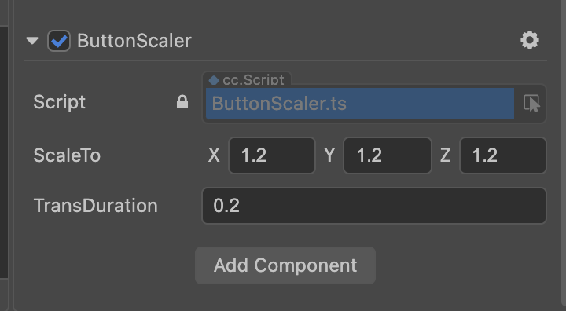

# cocos creator 3.0 组件库

## 组件列表
### 1. Toast (吐司)

> scene: assets/examples/badge/Main.scene

用法：

```ts
// example: assets/examples/toast_and_popup/script/BtnContrl.ts
import { Toast, Gravity } from '../../../components/Toast/Toast';

Toast.show('滚滚长江东逝水' + ((Math.random() * 10) >> 0).toString(), Toast.LENGTH_SHORT);

```

效果图


### 2. Modal (弹窗)

> scene: assets/examples/badge/Main.scene

用法：

```ts
// example: assets/examples/toast_and_popup/script/BtnContrl.ts
import { PopupManager } from '../../../components/Popup/Manager/PopupManager';

  onLoad() {
    PopupManager.instance.init();
  }

  showModal() {
    PopupManager.instance.show({
      priority: 999,
      prefab: this.popupPrefab,
    });
  }
```

效果如下


### 3. Badge (徽标)

> scene: assets/examples/badge/Main.scene

用法：在`cocos creator`编辑器中，给需要添加徽标的组件挂载`Badge`脚本作为组件即可


效果如下


## Helpers
### 1. ButtonScaler (按钮点击缩放效果)

用法：将 `ButtonScaler`添加为组件即可



效果图

